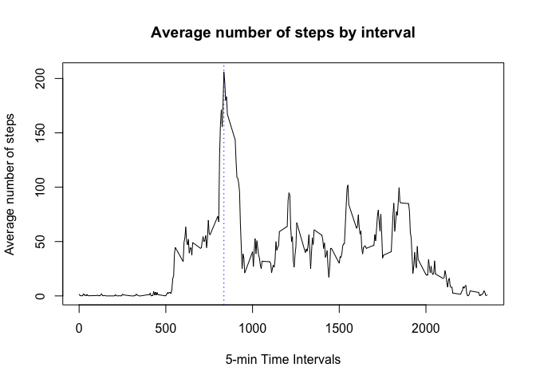

# Reproducible Research: Peer Assessment 1
Cania Chung  
August 5, 2016  


## Data

The data for this assignment can be downloaded from the course web
site:

* Dataset: [Activity monitoring data](https://d396qusza40orc.cloudfront.net/repdata%2Fdata%2Factivity.zip) 

The variables included in this dataset are:

* **steps**: Number of steps taking in a 5-minute interval (missing
    values are coded as `NA`)

* **date**: The date on which the measurement was taken in YYYY-MM-DD
    format

* **interval**: Identifier for the 5-minute interval in which
    measurement was taken

## Loading and preprocessing the data

Unzip the activity.zip to obtain the csv file. Read the csv table into the data frame called rawdata.  

```r
unzip (zipfile="activity.zip", exdir = "./data")
rawdata <- read.csv(file="data/activity.csv", header=TRUE, sep=",", colClasses=c("integer", "Date", "integer"))
mydata <- rawdata
str(mydata)
```

```
## 'data.frame':	17568 obs. of  3 variables:
##  $ steps   : int  NA NA NA NA NA NA NA NA NA NA ...
##  $ date    : Date, format: "2012-10-01" "2012-10-01" ...
##  $ interval: int  0 5 10 15 20 25 30 35 40 45 ...
```

```r
summary(mydata)
```

```
##      steps             date               interval     
##  Min.   :  0.00   Min.   :2012-10-01   Min.   :   0.0  
##  1st Qu.:  0.00   1st Qu.:2012-10-16   1st Qu.: 588.8  
##  Median :  0.00   Median :2012-10-31   Median :1177.5  
##  Mean   : 37.38   Mean   :2012-10-31   Mean   :1177.5  
##  3rd Qu.: 12.00   3rd Qu.:2012-11-15   3rd Qu.:1766.2  
##  Max.   :806.00   Max.   :2012-11-30   Max.   :2355.0  
##  NA's   :2304
```
## What is mean total number of steps taken per day?

For this part of the assignment, you can ignore the missing values in
the dataset.


1. Calculate and report the **mean** and **median** total number of steps taken per day

    1a. Calculate the mean. Using tapply functional to calculate the total steps. 

```r
dailysteps <- tapply(mydata$steps, mydata$date, sum, na.rm=TRUE)
step_mean <- mean(dailysteps)
round(step_mean)
```

```
## [1] 9354
```
    1b. Calculate the median

```r
step_median <- median(dailysteps)
round(step_median)
```

```
## [1] 10395
```
2.  Make a histogram of the total number of steps taken each day

```r
hist(dailysteps, main="Number of Steps taken per day", xlab="Steps per day", ylab="Frequency")
abline(v=step_mean, col="red", lwd=3)
abline(v=step_median, col="blue", lwd=3)
```

<!-- -->

## What is the average daily activity pattern?
1. Make a time series plot (i.e. `type = "l"`) of the 5-minute interval (x-axis) and the average number of steps taken, averaged across all days (y-axis)


```r
avgsteps_perinterval <- aggregate(steps ~ interval, mydata, mean)

# Plot the time series
plot(avgsteps_perinterval$interval,avgsteps_perinterval$steps, type="l", col=1, main="Average number of steps by interval", xlab="5-min Time Intervals", ylab="Average number of steps")
```

<!-- -->

2. Which 5-minute interval, on average across all the days in the dataset, contains the maximum number of steps?


```r
highest <- which.max(avgsteps_perinterval$steps)
plot(avgsteps_perinterval$interval,avgsteps_perinterval$steps, type="l", col=1, main="Average number of steps by interval", xlab="5-min Time Intervals", ylab="Average number of steps")

## Add the line to indicate the maximum 
abline(v=avgsteps_perinterval[highest,]$interval, lty=3, col="blue")
```

<!-- -->

```r
print (paste("The interval contains the maximum number of steps is", avgsteps_perinterval[highest,]$interval))
```

```
## [1] "The interval contains the maximum number of steps is 835"
```

```r
print (paste("The number of steps of that interval is", avgsteps_perinterval[highest,]$steps))
```

```
## [1] "The number of steps of that interval is 206.169811320755"
```
## Imputing missing values

Note that there are a number of days/intervals where there are missing
values (coded as `NA`). The presence of missing days may introduce
bias into some calculations or summaries of the data.

1. Calculate and report the total number of missing values in the dataset (i.e. the total number of rows with `NA`s)

```r
missingstep <- is.na(mydata$steps)
table(missingstep)
```

```
## missingstep
## FALSE  TRUE 
## 15264  2304
```

```r
missingdate <- is.na(mydata$date)
table(missingdate)
```

```
## missingdate
## FALSE 
## 17568
```

```r
missinginterval <- is.na(mydata$interval)
table(missinginterval)
```

```
## missinginterval
## FALSE 
## 17568
```

```r
missing <- is.na(mydata)
table(missing)
```

```
## missing
## FALSE  TRUE 
## 50400  2304
```

```r
print (paste("The total number of missing values in the dataset is "))
```

```
## [1] "The total number of missing values in the dataset is "
```

2. Devise a strategy for filling in all of the missing values in the dataset. The strategy does not need to be sophisticated. For example, you could use the mean/median for that day, or the mean for that 5-minute interval, etc.

```r
for (i in 1:nrow(mydata)) {
    if(is.na(mydata$steps[i])) {
        val <- avgsteps_perinterval$steps[which(avgsteps_perinterval$interval == mydata$interval[i])]
        mydata$steps[i] <- val 
    }
}
```
3. Create a new dataset that is equal to the original dataset but with the missing data filled in.

```r
str(rawdata)
```

```
## 'data.frame':	17568 obs. of  3 variables:
##  $ steps   : int  NA NA NA NA NA NA NA NA NA NA ...
##  $ date    : Date, format: "2012-10-01" "2012-10-01" ...
##  $ interval: int  0 5 10 15 20 25 30 35 40 45 ...
```

```r
str(mydata)
```

```
## 'data.frame':	17568 obs. of  3 variables:
##  $ steps   : num  1.717 0.3396 0.1321 0.1509 0.0755 ...
##  $ date    : Date, format: "2012-10-01" "2012-10-01" ...
##  $ interval: int  0 5 10 15 20 25 30 35 40 45 ...
```

4. Make a histogram of the total number of steps taken each day and Calculate and report the **mean** and **median** total number of steps taken per day. Do these values differ from the estimates from the first part of the assignment? What is the impact of imputing missing data on the estimates of the total daily number of steps?


```r
impute_steps_perday <- aggregate(steps ~ date, mydata, sum)

hist(impute_steps_perday$step, main="Histogram of total number of steps per day (Imputed)", xlab="Steps per day")
```

<!-- -->

```r
imputemean <- round(mean(impute_steps_perday$step))
print (paste("Mean of total number of steps taken per day is ", imputemean))
```

```
## [1] "Mean of total number of steps taken per day is  10766"
```

```r
imputemedian <- round(median(impute_steps_perday$step))
print (paste("Median of total number of steps taken per day is ", imputemedian))
```

```
## [1] "Median of total number of steps taken per day is  10766"
```


## Are there differences in activity patterns between weekdays and weekends?
For this part the `weekdays()` function may be of some help here. Use
the dataset with the filled-in missing values for this part.

1. Create a new factor variable in the dataset with two levels -- "weekday" and "weekend" indicating whether a given date is a weekday or weekend day.


```r
# add a new column indicating day of the week 
rawdata$day <- weekdays(rawdata$date)

# add a new column called day type and initialize to weekday
rawdata$daytype <- c("weekday")

# If day is Saturday or Sunday, make day_type as weekend
for (i in 1:nrow(rawdata)){
  if (rawdata$day[i] == "Saturday" || rawdata$day[i] == "Sunday"){
    rawdata$daytype[i] <- "weekend"
  }
}

# convert day_time from character to factor
rawdata$day_type <- as.factor(rawdata$daytype)

# aggregate steps as interval to get average number of steps in an interval across all days
table_interval_steps_imputed <- aggregate(steps ~ interval+daytype, rawdata, mean)
```

2. Make a panel plot containing a time series plot (i.e. `type = "l"`) of the 5-minute interval (x-axis) and the average number of steps taken, averaged across all weekday days or weekend days (y-axis). 


```r
library(ggplot2)
qplot(interval, steps, data=table_interval_steps_imputed, geom=c("line"), xlab="Interval", 
      ylab="Number of steps", main="") + facet_wrap(~ daytype, ncol=1)
```

<!-- -->
